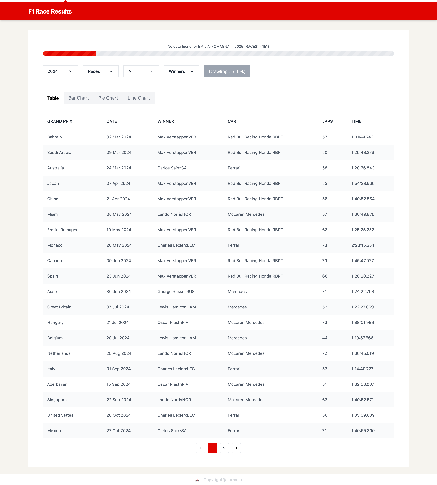
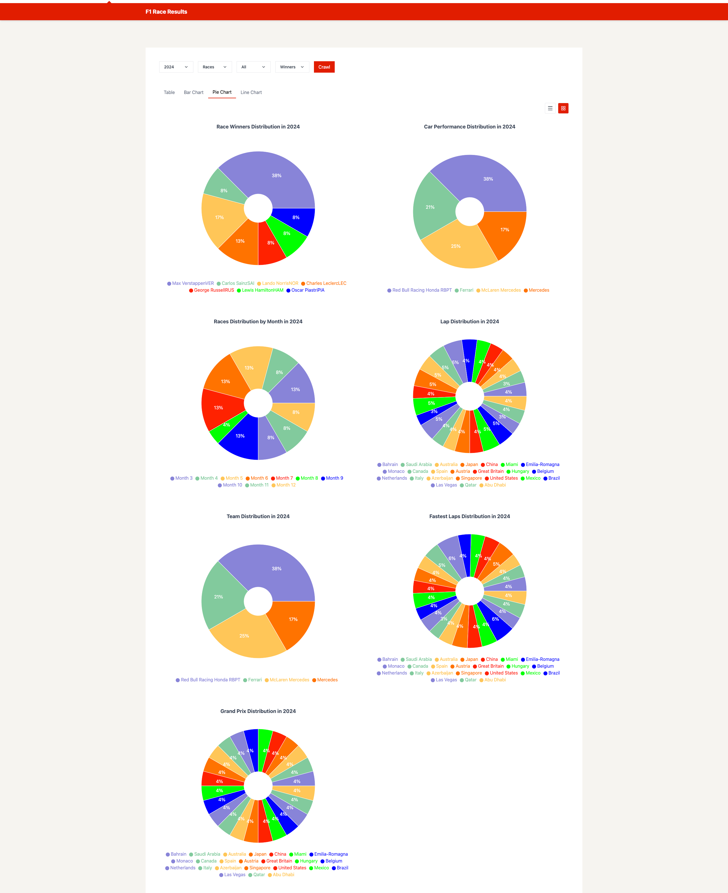

English

# F1 Crawler Application

## English

### Overview
The F1 Crawler is a web application designed to fetch and display Formula 1 (F1) racing data from various sources. It allows users to explore historical and current F1 race results, team standings, driver statistics, and more. Built with modern web technologies, the app provides an interactive interface with real-time progress tracking during data crawling.

### Demo
<div style="display: flex; flex-wrap: wrap; gap: 10px;">
  <div style="width: 48%;">
    
    
    
  </div>
  <div style="width: 48%;">
    
    
    
  </div>
</div>


### Features
- **Data Crawling**: Fetches F1 data (races, drivers, teams) from a server with real-time progress updates using Web Workers and WebSocket.
- **Interactive Filters**: Users can filter data by year, race type (e.g., races, drivers, teams), and Grand Prix events.
- **Visualization**: Displays data in tabular format (using a custom `Table` component) and bar charts (using Recharts).
- **Responsive UI**: Clean and user-friendly interface with progress bars to show crawling status.
- **Type Safety**: Written in TypeScript for robust type checking and error prevention.

### Setup Instructions
1. **Prerequisites**
   - Node.js (v16 or higher)
   - npm or Yarn
   - A running F1 data server with WebSocket support (e.g., `wss://your-api.com/f1/crawl`)

2. **Installation**
   ```bash
   git clone <repository-url>
   cd f1-crawler
   npm install

1.  **Configuration**
    -   Update the WebSocket URL in src/workers/f1Worker.js to match your server:

        javascript

        WrapCopy

        `const socket = new WebSocket('wss://your-api.com/f1/crawl');`

    -   Ensure your server sends progress messages in the format: { progress: number, message: string, data?: any, error?: string }.

3.  **Running the App**

    bash

    WrapCopy

    `npm run dev`\
    Open your browser at http://localhost:5173 (default Vite port).

5.  **Build for Production**

    bash

    WrapCopy

    `npm run build npm run preview`

### Technologies Used

-   **Frontend**: React, TypeScript, Recharts, Tailwind CSS

-   **State Management**: Custom hooks (useF1Data)

-   **Data Fetching**: Web Workers, WebSocket

-   **Build Tool**: Vite

-   **Linting**: ESLint (with no-console rule enabled)

### Usage

-   Select a year, type, and Grand Prix from the dropdowns to fetch specific F1 data.

-   Watch the progress bar for real-time updates as the data is crawled.

-   View results in a table or chart depending on the selected type.

Tiếng Việt
----------

### Tổng Quan

Ứng dụng F1 Crawler là một ứng dụng web được thiết kế để thu thập và hiển thị dữ liệu đua xe Công thức 1 (F1) từ nhiều nguồn khác nhau. Nó cho phép người dùng khám phá kết quả đua xe F1 lịch sử và hiện tại, bảng xếp hạng đội, thống kê tay đua, và nhiều thông tin khác. Được xây dựng bằng các công nghệ web hiện đại, ứng dụng cung cấp giao diện tương tác với tính năng theo dõi tiến độ thời gian thực trong quá trình thu thập dữ liệu.

### Tính Năng

-   **Thu Thập Dữ Liệu**: Lấy dữ liệu F1 (cuộc đua, tay đua, đội đua) từ server với cập nhật tiến độ thời gian thực sử dụng Web Workers và WebSocket.

-   **Bộ Lọc Tương Tác**: Người dùng có thể lọc dữ liệu theo năm, loại đua (ví dụ: races, drivers, teams), và các sự kiện Grand Prix.

-   **Trực Quan Hóa**: Hiển thị dữ liệu dưới dạng bảng (sử dụng component Table tùy chỉnh) và biểu đồ thanh (sử dụng Recharts).

-   **Giao Diện Thân Thiện**: Giao diện sạch sẽ, dễ sử dụng với thanh tiến độ hiển thị trạng thái thu thập dữ liệu.

-   **An Toàn Kiểu**: Được viết bằng TypeScript để kiểm tra kiểu chặt chẽ và tránh lỗi.

### Hướng Dẫn Cài Đặt

1.  **Yêu Cầu Trước**
    -   Node.js (phiên bản 16 trở lên)

    -   npm hoặc Yarn

    -   Một server dữ liệu F1 đang chạy với hỗ trợ WebSocket (ví dụ: wss://your-api.com/f1/crawl)

3.  **Cài Đặt**

    bash

    WrapCopy

    `git clone <repository-url> cd f1-crawler npm install`

5.  **Cấu Hình**
    -   Cập nhật URL WebSocket trong src/workers/f1Worker.js để khớp với server của bạn:

        javascript

        WrapCopy

        `const socket = new WebSocket('wss://your-api.com/f1/crawl');`

    -   Đảm bảo server của bạn gửi thông điệp tiến độ theo định dạng: { progress: number, message: string, data?: any, error?: string }.

7.  **Chạy Ứng Dụng**

    bash

    WrapCopy

    `npm run dev`\
    Mở trình duyệt tại http://localhost:5173 (cổng mặc định của Vite).

9.  **Build cho Production**

    bash

    WrapCopy

    `npm run build npm run preview`

### Công Nghệ Sử Dụng

-   **Frontend**: React, TypeScript, Recharts, Tailwind CSS

-   **Quản Lý Trạng Thái**: Hook tùy chỉnh (useF1Data)

-   **Thu Thập Dữ Liệu**: Web Workers, WebSocket

-   **Công Cụ Build**: Vite

-   **Kiểm Tra Mã**: ESLint (với quy tắc no-console được bật)

### Cách Sử Dụng

-   Chọn năm, loại đua, và Grand Prix từ các menu thả xuống để lấy dữ liệu F1 cụ thể.

-   Theo dõi thanh tiến độ để cập nhật thời gian thực khi dữ liệu được thu thập.

-   Xem kết quả trong bảng hoặc biểu đồ tùy thuộc vào loại dữ liệu đã chọn.
